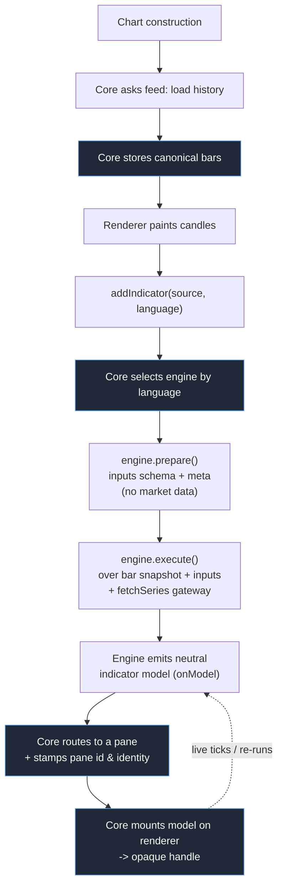

# Data Flow

This page traces how data moves through Vela, from loading the first bar to keeping an indicator live. The throughline is simple: **the core owns the data and orchestrates every step**, and **the neutral model is the only thing that crosses a port.**

For the structural picture see [overview.md](overview.md); for the contracts involved see [modules.md](modules.md).

## The end-to-end happy path

Step by step:

1. **Load history.** The core asks the feed to load history for the symbol and timeframe. For deep history it shows a quick recent-window preview, then the first ~10k-bar chunk (`ready()` resolves here — the chart is interactive), then **backfills older bars backward in bounded chunks** while preserving the viewport — emitting `history:progress` per chunk and `history:complete` at the end. Each session poke during the backfill carries the reason `'backfill'`, and the finish carries `'complete'`; run policy stays with the engine — the bundled Pine engines hold their first run until `'complete'`, so an indicator computes exactly once, over the full depth.
2. **Store canonical bars.** The core stores the returned bars as the canonical array. This is the source of truth.
3. **Paint candles.** The renderer paints the candles immediately — a bare chart is already useful with no engine involved.
4. **Add an indicator.** `addIndicator` names a script and its language. The core selects a registered engine **by language**. (No engine for that language → an actionable error; there is no default.)
5. **Prepare.** The engine cheaply parses the script and returns its inputs schema, metadata, and an initial guess at viewport-dependence. Prepare sees **no market data**.
6. **Execute.** The core calls execute over a **snapshot of the canonical bars**, plus the resolved inputs, market metadata, and a `fetchSeries` gateway for secondary data.
7. **Emit a neutral model.** The engine emits a neutral indicator model through `onModel` — on the first run and on every subsequent re-run or tick.
8. **Route and mount.** The core routes the model to the right pane (overlay vs study), stamps the pane id and the element identities, and mounts it on the renderer, receiving back an opaque handle.

## Single ownership of data

The core is the **sole** loader and streamer of primary price data. Engines do not fetch the bars they run on — they are *fed* a snapshot. The renderer does not fetch bars either — it is told what to paint. This single ownership is what makes the rest of the flow predictable.

When a script needs **secondary** data (another symbol or timeframe), it does not reach for the network. It goes through the core-supplied, cache-backed **`fetchSeries` gateway**. This gateway performs **no timeframe aggregation** — timeframes are kept separate, and a request for a given timeframe returns that timeframe's bars. The gateway is the one sanctioned door for secondary series, so the core stays in control of all data movement.

## Stable identities enable in-place patches

When the core stamps identities onto a model, it uses **content-addressed, stable ids** — derived from the element's identity in the script, not from a transpile counter. The same source produces the same ids on every run.

That stability is what makes efficient live updates possible. When a tick arrives, the engine re-emits a model whose elements carry the *same* ids as before, so the core can tell the renderer to **patch the exact existing series or drawing in place** rather than tear down and rebuild it.

## Live and re-run pathways through the same model

Updates do not use a separate channel — they flow through the **same neutral model** as the first run. What differs is *how* the renderer applies the new model, and that choice is driven by the model itself, not by which event triggered it:

- **Value patch** — the structure is unchanged, only values moved. The renderer patches in place. This is the common case for ticks and viewport changes.
- **Structural remount** — the *shape* of the output changed, so the renderer rebuilds the indicator's presentation.

The renderer decides between these two by comparing the new model's shape against the mounted one — patch when the shape is unchanged, remount only when it actually changed. No trigger forces a remount on its own.

Three triggers cause a re-run. The application column below is the **typical** outcome, not a fixed rule:

| Trigger | Why it fires | Typical application |
| --- | --- | --- |
| **Input edit** | A changed input *can* restructure the output | Structural remount **only if the output shape changed** — many input edits just move values and stay a value patch |
| **Viewport change** | Only for viewport-aware scripts | Value patch |
| **Bar change** | A live tick or a new bar arrived | Value patch |

In other words, an input edit is the trigger *most likely* to change shape, which is why it is the one associated with remounts — but the renderer still patches in place when the edit leaves the shape intact.

## Static vs streaming routing

Whether an update takes the **live** path or the **static re-run** path is a **capability-driven routing decision** made by the core, not a mode the script picks.

The core takes the live streaming path only when *all* of these hold:

- the chart is live, **and**
- the script is not viewport-dependent, **and**
- the engine declares the streaming capability.

If any condition fails, the core uses the static re-run path: it pokes the engine to execute again over the current bar snapshot. (This is also why the off-thread Pine form, which declares no streaming capability, always takes the static re-run path — see [modules.md](modules.md).) Both paths end in the same place — a neutral model the core routes and the renderer applies. This routing condition is one of the core invariants; it is restated in [boundaries.md](boundaries.md).

## Causal, stateful execution

Scripts in Vela are **causal and stateful**: a value at a bar can depend on every bar before it. Because of that, the engine always runs over the **full history**, never just the visible window.

This is why the viewport is not an execution scope. A viewport change changes *what a viewport-aware script computes* (for instance, a calculation that references the visible range), but it never narrows the set of bars the engine runs over. Correctness depends on the engine always seeing the whole causal chain.
