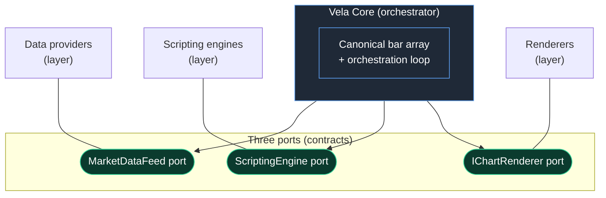

# Architecture Overview

Vela is a modern charting library built around one deliberate shape: a **robust core** surrounded by **three independently-extensible layers**. The core does the orchestration; each layer plugs in through a single narrow port. Nothing in the core knows about any concrete backend — it depends only on the ports and on a shared **neutral model**.

This page explains that shape, why it holds together, and how you extend it.

## The defining shape

One core. Three layers. Three ports.

- **Data providers** supply market data through the **market-data feed** port.
- **Scripting engines** run indicator logic through the **scripting engine** port.
- **Renderers** draw to the screen through the **renderer** port.

Each layer is reached through exactly one narrow contract. The core depends on those contracts and never on a specific implementation behind them. Because no backend-specific type is allowed to cross a port, any layer can be replaced without the core — or the other two layers — noticing.

The core sits in the middle and talks only to the ports. The layers sit on the outside and satisfy the ports. The arrows only ever point from the core to a contract — never to a name inside a layer.

## The neutral model: the lingua franca

Every layer speaks the same language across its port: the **neutral model**. It describes everything the system passes around — bars, series, pane overlays, drawings, inputs, and the update patches that keep them current — in terms that belong to no particular backend.

The neutral model is the *only* thing allowed to cross a port boundary. A data provider hands the core neutral bars. A scripting engine emits a neutral indicator model. A renderer receives neutral instructions to mount and patch. None of them leak their own internal types outward.

That opacity is the whole point. It is what lets you swap a renderer without touching an engine, or add a data provider without teaching the renderer anything new. The neutral model is the contract; the ports are where it is spoken.

Time is part of this shared language: it is canonical epoch **milliseconds** everywhere in the model. Each renderer converts to whatever its own surface expects at its own boundary — the core never bends to a backend's clock.

## What the core owns

The core is not a thin pass-through. It owns two things outright:

- **The canonical bar array.** The core is the single loader and streamer of primary price data. It asks the feed for history, stores the result, and is the source of truth for "what are the bars." Engines are *fed* bars; they never fetch primary data themselves.
- **The orchestration loop.** Loading, painting, selecting an engine per indicator, routing output to the right pane, stamping stable identities, and pushing updates on every tick — all of that is core responsibility. The layers do focused work; the core decides when and in what order.

This single ownership is why the layers can stay narrow. They don't coordinate with each other; the core coordinates them.

The same principle extends to **interactive drawings** — the tools a *user* draws on the chart, distinct from the lines/boxes a scripting engine *emits*. The core owns that model too (the store, undo/redo history, clipboard), and reaches the renderer through a second, drawings-specific port; only JSON crosses, anchors stay in time + price, and a renderer that can't paint them still lets the model serialize and round-trip. See [ADR 0005 — Core owns user drawings](./adr/0005-core-owns-user-drawings.md) and the [drawing-tools guide](../user/drawing-tools.md).

## Defaults vs opt-in

A freshly constructed chart is never empty of capability — but it is deliberately not fully loaded either.

- **A renderer is always present.** Without one there would be nothing to look at, so the composition root wires a default.
- **A data feed is always present.** Without one there would be no bars, so the composition root wires a default.
- **There is deliberately NO default scripting engine.** A bare chart is **candles-only**. Scripting is opt-in.

The absence of a default engine is a design decision, not an oversight. Indicator execution is heavy and language-specific, so the core refuses to assume one for you. If you call for an indicator and no engine has been registered for its language, the core throws an **actionable error** rather than guessing. You decide which engine(s) to bring.

The bundled defaults are all **swappable defaults**, never load-bearing assumptions:

- the **native renderer** (default; WebGL2 with a canvas2d fallback),
- the **provider-backed, cache-wrapped data feed**,
- and — for the engine layer — **nothing at all**. No scripting engine ships with Vela: the port is the product, and you install an addon (Pine Script: `@luxalgo/vela-pinets`) or write your own. See [Scripting engines](../user/scripting-engines.md).

An engine's **declared capabilities** — not its packaging — decide how the core routes it: an engine that declares `streaming` gets the live persistent-session path, one that doesn't gets static re-runs poked per bar change. Two engines for the same language can differ there (a main-thread one and a worker-backed one need not be capability-equivalent), and the core never guesses: it takes each declaration at face value. See [modules.md](modules.md) for the layer's defaults and [data-flow.md](data-flow.md) for how that choice drives routing.

The port is deliberately renderer-agnostic — a custom `IChartRenderer` class passed as `options.renderer` swaps the whole backend.

## The uniform "add an X" story

Every extension point follows the same shape: implement the port, declare honest capabilities, and hand the implementation to the composition root.

- **Add a renderer** → implement the renderer port → inject it.
- **Add an engine** → implement the engine port → register it by language.
- **Add a data provider** → implement the feed port → inject it.

The details differ slightly per layer (engines are selected per-indicator by language; renderer and feed are injected directly), but the mental model is identical: *one port, one honest capability declaration, one injection point.* See [modules.md](modules.md) for each contract in depth and [data-flow.md](data-flow.md) for how a request travels through them.

## Capability negotiation

The ports are narrow, but backends differ in what they can actually do. Vela resolves that difference through **declared capabilities** rather than feature-sniffing. Each backend tells the core, up front, what it supports — for engines, things like whether they can stream; for renderers, things like which presentation features they can draw — and the core trusts those flags and routes accordingly. Only an engine that declares it can stream, for example, ever takes the live-streaming path.

That trust is load-bearing: a backend that declares a capability it doesn't truly have produces silently wrong output, because the core takes it at its word. The full set of declared flags and the **capability honesty** invariant that governs them live with the other core invariants in [boundaries.md](boundaries.md), alongside the import boundaries and registry semantics the core relies on.
