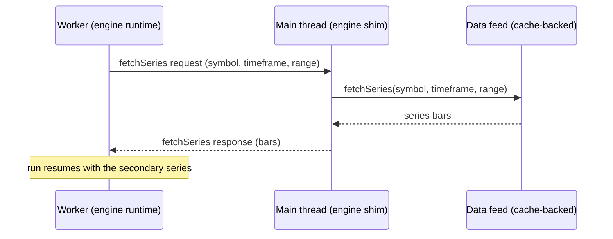

# Adding a Scripting Engine

Scripting engines are one of Vela's three swappable **layers** (alongside [data providers](./adding-a-data-provider.md) and [renderers](./adding-a-renderer.md)). This page explains what an engine is, the small surface you implement, and the rules the core uses to drive it. It is conceptual — for the exact field shapes, read the `ScriptingEngine` port in the source.

> The engine port is stable in shape but still evolving.

## What an engine is

An engine turns **source in some language** into a **neutral drawable model** — the same indicator model every renderer knows how to paint. The Pine engine is the bundled default (in two forms, in-process and Web Worker), but nothing about the core is Pine-specific.

The core never learns the language, the runtime, or how the source was evaluated. It hands the engine source text plus market context and gets back a stream of neutral models. That opacity is the whole point: it is what lets one chart run Pine today and another language tomorrow without touching the core.

The core owns everything downstream of the model — pane routing (overlay vs study), stable element ids, and mounting on the renderer. The engine emits an **unrouted** model and stays out of presentation entirely.

## The surface you implement

An engine is a small object with four things:

- **A unique language id** — e.g. `'pine'`. This is the registry key the core selects on.
- **An honest capabilities object** — three booleans the core trusts without re-checking:
  - `streaming` — can keep a persistent incremental context alive for live ticks (vs a full re-run each time).
  - `visibleRange` — understands viewport-dependent execution (scripts that read "the left/right visible bar time").
  - `inputs` — exposes an inputs schema that drives the renderer's settings dialog.
- **`prepare`** — a cheap, async parse.
- **`execute`** — the run.

Capability honesty matters. The core routes on these flags and does not second-guess them. A backend that advertises `streaming: true` but cannot actually stream produces silent wrong output, not an error.

### prepare — a cheap parse, no market data

`prepare(source, instanceId)` parses the script and resolves to a **prepared script** descriptor. It is **async** — it returns a Promise the core awaits — so a parser can be loaded or run off the hot path. It touches **no market data** — no bars, no fetches, nothing that hits the network. It only inspects the source.

It resolves to:

- **An inputs schema** — the typed inputs the script exposes (the renderer turns this into a settings UI).
- **Declaration metadata** — what the script declares about itself (title, overlay vs study intent, and so on).
- **A static `reactsToViewport` guess** — whether the source references a viewport built-in. This is a *static guess*, detected by scanning the source; it can be refined after the first real run.
- **An opaque engine-internal token** — whatever the engine wants to read back at execute time (a parsed AST, a compiled function, a handle). The core treats it as a black box and never inspects it.

Because `prepare` is cheap and data-free, the core can call it eagerly to build settings UI before any execution happens.

### execute — synchronous handle, async run

Where `prepare` is async, `execute(request, handlers)` is the opposite: it returns an **execution session synchronously**, even though the actual run is asynchronous. The session is a handle the core holds immediately; results arrive later through the handlers. This split is the single biggest source of confusion for new authors, so keep it crisp: the call returns a control surface right away, and the work happens behind it.

The request carries everything the run needs: the prepared script, market context (symbol, timeframe, optional symbol info), the bar snapshot, resolved input values, an optional visible range, the `fetchSeries` gateway, and a `mode`.

## The data inversion (the heart of it)

This is the rule that surprises most engine authors: **engines never fetch the chart's own candles.**

The core owns the canonical bar array and is the sole loader and streamer of primary data. It passes those bars **into** `execute` as a snapshot, plus a live accessor the engine reads on each re-run or tick. The engine is *fed* its data; it does not go get it.

Secondary series are different but still inverted. When a script needs another series — a higher or lower timeframe, or a different symbol (Pine's `request.security`) — it does not open its own connection. It calls the **`fetchSeries` gateway** the core supplies, keyed by `(symbol, timeframe)`. That gateway is cache-backed by the chart's data feed, so secondary series get real, correctly-resolved data. There is **no aggregation**: timeframes are kept separate, never derived from the primary bars by rolling them up. If a script asks for an hourly series, the gateway fetches hourly data.

If no gateway is supplied, secondary fetches degrade to empty rather than failing — the primary series still runs.

Why it matters: causality. Scripts are stateful and run over **all** bars, never just the visible window. Centralizing data ownership in the core keeps one consistent, correctly-ordered, deduped bar history feeding every engine and renderer. The viewport changes *what* a viewport-aware script computes — it never scopes *which* bars execute.

## The session: the control surface the core drives

The execution session is how the core drives a running script. It exposes four levers:

- **`stop()`** — tear down; stops any streaming or incremental re-execution.
- **`update(inputs)`** — re-run (or re-stream) with merged input overrides. An input can restructure output, so this can be a structural change.
- **`setVisibleRange(range)`** — push a new viewport window. Re-runs viewport-dependent scripts; a no-op for everything else.
- **`notifyBars()`** — signal that the core's bars changed (forming candle or a new bar) so the engine re-executes.
- **`getContext(select?)`** *(optional)* — resolve a read-only `EngineContextSnapshot` of the run (phase, bar index, plots, serializable variables, the script's return value, warnings). Implement it if your language has host-inspectable state; return **copies only** (never live references), keep it async (the bundled worker engine answers over `postMessage`), and honor `select` so callers can limit extraction. Skipping it is fine — `handle.context()` then resolves `null`.

Results flow back the other way, through the **handlers** event sink:

- **`onModel(model)`** — the produced neutral model. This fires on the **first run AND on every re-run / live tick**. It is not a one-shot; treat it as a stream of model snapshots.
- **`onAlert` / `onWarning` / `onError`** — optional diagnostics and failures.
- **`onDone`** — a *static* run finished. It is **not** fired for an open live stream (a live stream has no "done").

Think of it as: the core pulls the session's levers, the engine pushes models and events back. New authors most often trip on the session **lifecycle** — forgetting that `onModel` repeats, or holding resources past `stop()`. Wire `stop()` to release everything, and make every `onModel` emission a complete, self-consistent model.

## Static vs live modes

The request's `mode` is `'static'` or `'live'`, and it is a **capability-gated routing decision** the core makes — not something the engine picks.

- **Static** — runs on demand and re-runs when the session is poked (`update`, `setVisibleRange`, `notifyBars`). Each poke is a fresh run.
- **Live** — keeps a persistent streaming context that emits per tick. The core only requests live mode when the chart is live, the script is not viewport-dependent, **and** the engine declares `streaming: true`. Otherwise it falls back to the static re-run path.

So a non-streaming engine still updates on live data — it just does it by re-running statically on each `notifyBars`, rather than maintaining an incremental context.

## One runtime, two engines: the transport-agnostic pattern

The in-process and Web Worker Pine engines are not two implementations. They share a **transport-agnostic runtime**: a neutral run function plus a context-to-model mapper. The run function evaluates source over bars; the mapper turns the resulting context into a neutral model. Neither knows whether it lives on the main thread or in a worker.

That shared core is what lets **one implementation power both** an in-process engine and a worker engine.

The worker substrate is **the same port re-expressed over a serializable message protocol**. Concretely:

- **Bars are shipped as data** on each call (structured-clone across the thread boundary), not shared by reference.
- **Handler callbacks become messages** — `onModel`, alerts, warnings, errors, done all arrive as posted messages the main-thread shim re-dispatches to your handlers.
- **A `fetchSeries` call becomes a request/response pair** — the worker cannot reach the data feed, so it asks the main thread, which answers.

### Worker fetchSeries round-trip

From the engine runtime's point of view, calling `fetchSeries` looks identical in both forms — only the transport differs.

## Registering and selecting engines

There is **no default engine**. A bare chart shows candles only; running an indicator with no engine throws an explicit, actionable error telling you to register one.

Register engines by **language id**, two ways:

- **Bulk at construction** — pass engines in the dependency object; each is registered under its own `language`.
- **A `registerEngine(language, engine)` call** — register (or replace) one after construction.

Re-registering a language is **last-wins**, and applies to *future* indicators only — already-running sessions keep their engine.

### How the core picks an engine for an indicator

Selection happens **per indicator**, and the core resolves it in just two steps:

1. The indicator's own `language`, if `addIndicator` was given one.
2. Otherwise the chart's `defaultLanguage`.

The key thing to internalize: **`defaultLanguage` is fixed at construction.** It is not recomputed as you register engines. The core seeds it once when the chart is built — to the first engine you pass in the construction dependency object (falling back to `'pine'` if you pass none) — and it does not change afterward.

That has a real consequence: if you register an engine **only** through `registerEngine` after construction and never set `defaultLanguage`, the default still points at whatever it was seeded to. A no-language `addIndicator` will then resolve to that seeded language — and if nothing is registered under it, you get the actionable error, not silent candles-only behavior.

So, to make a language the default, do one of:

- **Pass that engine in the construction dependency object** so it seeds `defaultLanguage`, or
- **Set `defaultLanguage` explicitly** to a language you have registered, or
- **Name the `language` on each `addIndicator` call** to bypass the default entirely.

Whichever path you choose, if the resolved language has no registered engine, you get the actionable error.

## Gotchas

- **`reactsToViewport` is a static guess.** `prepare` detects viewport built-ins by scanning source. The first real run can prove the guess wrong; an engine may refine the flag in place afterward. Don't treat the prepare-time value as final.
- **`prepare` is async, `execute` is sync.** Await the `prepare` Promise before you build settings UI; expect `execute` to hand back a session immediately and deliver results through handlers.
- **In-process and worker can advertise different capabilities.** They share a runtime but not their capability flags — route on what each form actually declares. (Both bundled Pine forms declare `streaming: true` today; the worker holds its persistent stream inside the worker and receives live bars as small deltas.)
- **The worker is spawned from a Blob URL by default.** The worker is inlined at build time and instantiated from a Blob URL. Under a strict Content-Security-Policy, `worker-src blob:` (or equivalent) must be allowed, or the worker engine will fail to start. If you cannot allow `blob:`, the worker engine accepts a `workerUrl` option pointing at a hosted worker script you serve yourself — use that to satisfy a `worker-src 'self'` (or specific-origin) policy instead. The in-process engine has no such caveat.
- **`onModel` is a stream, not a callback-once.** Build your session so every emission is complete and `stop()` releases everything.

## See also

- [Adding a Renderer](./adding-a-renderer.md) — the layer that paints the neutral model.
- [Adding a Data Provider](./adding-a-data-provider.md) — the feed that owns bars and backs `fetchSeries`.
